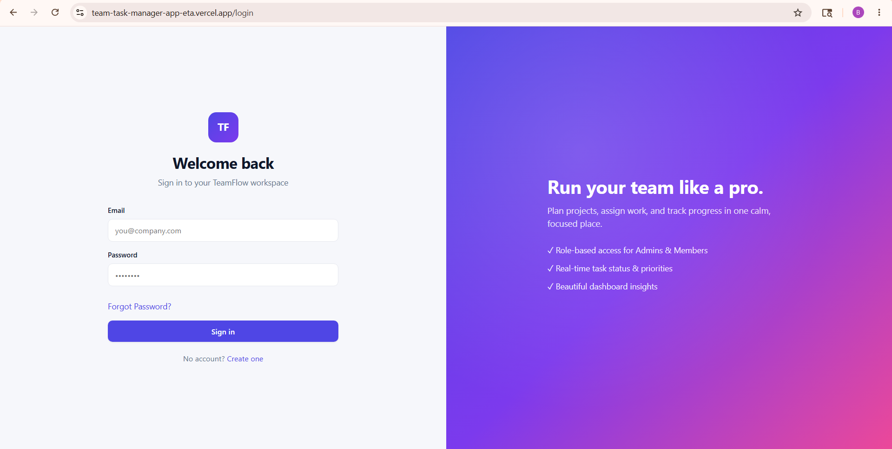
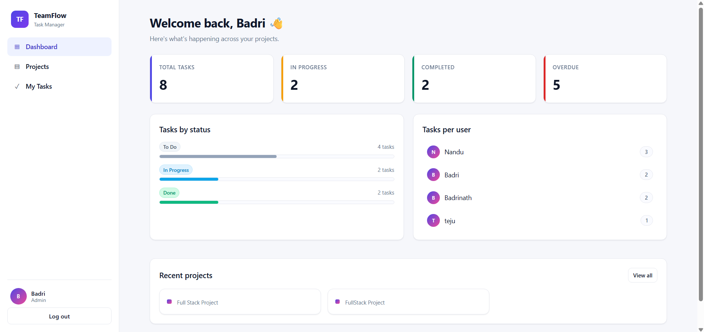
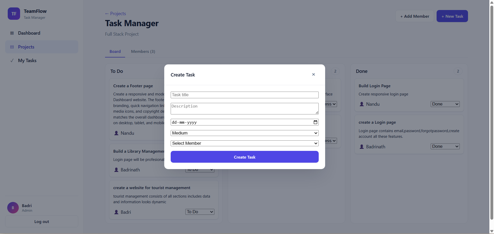
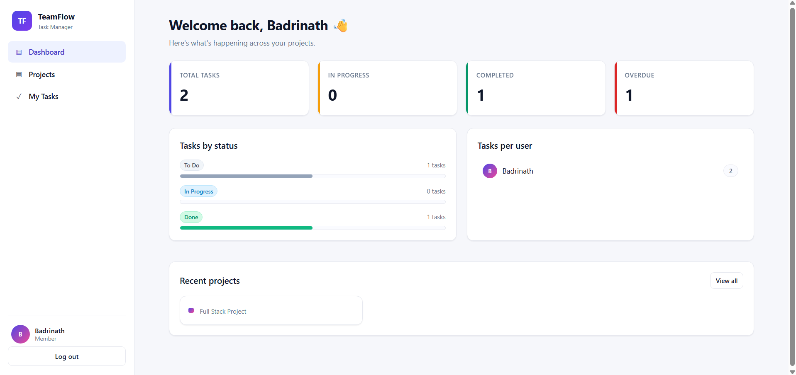

# Team Task Manager

A full-stack team collaboration and task management web application built using React, Node.js, Express, and MongoDB.

This project was developed as part of a Full-Stack Developer Assessment. The application allows teams to manage projects, assign tasks, track progress, and collaborate using role-based access control.

---

# Live Application

## Frontend (Vercel)

https://team-task-manager-app-eta.vercel.app

## Backend API (Render)

https://team-task-manager-app-pyq6.onrender.com

---

# GitHub Repository

https://github.com/badri143-alt/team-task-manager-app

---

# Demo Video

https://drive.google.com/file/d/1Jwz9lxoB-Qa4ZdvBY0LfIbFpFGLFODBs/view?usp=sharing

---


# Application Screenshots







# Project Overview

This application helps teams organize and track work efficiently.

## Workflow

1. Admin creates a project
2. Admin adds team members
3. Admin creates tasks
4. Tasks are assigned to members
5. Members update task progress
6. Admin tracks project progress from dashboard

---

# Features

## Authentication

* User Signup
* User Login
* JWT Authentication
* Protected Routes
* Forgot Password via Email

---

## Project Management

* Create Projects
* View Project Details
* Add Team Members
* Remove Members

---

## Task Management

* Create Tasks
* Assign Tasks to Members
* Update Task Status
* Delete Tasks
* Set Due Dates
* Set Priority Levels

---

## Dashboard

* Total Tasks
* Tasks by Status
* Overdue Tasks
* Team Progress Overview

---

# Role-Based Access Control

## Admin

* Create and manage projects
* Add or remove members
* Create tasks
* Update any task
* Delete tasks

## Member

* View assigned tasks
* Update assigned task status only

---

# Tech Stack

## Frontend

* React.js
* React Router DOM
* Context API
* CSS

## Backend

* Node.js
* Express.js
* MongoDB
* Mongoose
* JWT Authentication
* Nodemailer

---

# Project Structure

```bash
team-task-manager/
│
├── frontend/
│
├── backend/
│
└── README.md
```

---

# Frontend Setup

## 1. Navigate to frontend folder

```bash
cd frontend
```

## 2. Install dependencies

```bash
npm install
```

## 3. Create `.env` file

```env
VITE_API_BASE_URL=http://localhost:5000/api         
```

## 4. Start frontend server

```bash
npm run dev
```

Frontend runs on:

```bash
http://localhost:5173
```

---

# Backend Setup

## 1. Navigate to backend folder

```bash
cd backend
```

## 2. Install dependencies

```bash
npm install
```

## 3. Create `.env` file

```env
PORT=5000

MONGO_URI=your_mongodb_connection

JWT_SECRET=your_secret_key

EMAIL_USER=your_email

EMAIL_PASS=your_gmail_app_password

CLIENT_URL=http://localhost:5173
```

## 4. Start backend server

```bash
npm run dev
```

Backend runs on:

```bash
http://localhost:5000
```

---

# API Endpoints

## Authentication

```bash
POST /api/auth/signup
POST /api/auth/login
POST /api/auth/forgot-password
POST /api/auth/reset-password/:token
```

## Projects

```bash
GET /api/projects
POST /api/projects
POST /api/projects/:id/members
DELETE /api/projects/:id/members/:memberId
```

## Tasks

```bash
GET /api/tasks
POST /api/tasks
PUT /api/tasks/:id
DELETE /api/tasks/:id
```

---

# Deployment

## Frontend Deployment

Frontend is deployed using Vercel.

## Backend Deployment

Backend API is deployed using Render.

Environment variables were configured separately for production deployment.

---

# Challenges Faced

During development, I encountered several issues such as:

* Task status update bugs
* MongoDB enum validation errors
* Role-based access issues
* Frontend and backend API integration problems
* Deployment configuration issues

These problems were resolved through debugging API routes, validating schema values properly, and improving frontend-backend communication.

---

# What I Learned

* Building REST APIs
* JWT Authentication
* MongoDB Relationships
* Role-Based Access Control
* Full-Stack Debugging
* Environment Variable Management
* Frontend and Backend Deployment

---

# Future Improvements

* Drag and Drop Task Board
* Real-Time Notifications
* File Upload Support
* Team Chat
* Dark Mode

---

# Author

Badrinath

---

# License

This project was developed for educational and assessment purposes.
